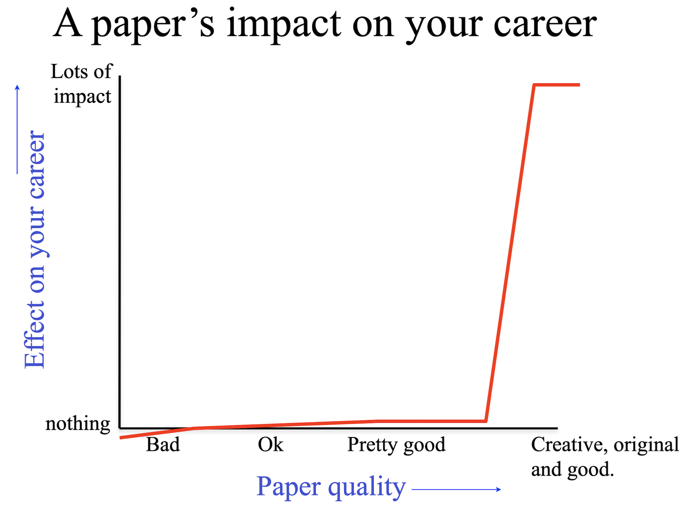

## About Me

Hey there! I’m Fred, a third-year Ph.D. student at Duke University. I have broad interests in machine learning and its applications in scientific problems. I work with [Anru](https://anruzhang.github.io/) on statistical machine learning, [Alex](https://www.alextong.net/) on generative models, [Chris](https://christian.dallago.us/) on ML4Bio. Previously, I worked with [Pranam](https://www.chatterjeelab.com/) on protein design when he was at Duke. 
In addition, I have wonderful collaborators, [Chengtong](https://github.com/Wangchentong) and [Zack](https://scholars.duke.edu/person/zachary.bezemek/research), who have taught me a great deal about proteins and probabilities.
My research aims to scale up the math on GPUs and see what wonderful things emerge.

I love coding and science. At the end of the day, what makes me proud isn’t necessarily publishing a paper. It’s making solid contributions that actually move the field forward — whether that’s a tool, a model, an equation, or a line of code that makes your life easier. I believe science should be accessible to everyone, and open-source is how I try to make that real - peep the goods on my [GitHub](https://github.com/pengzhangzhi). 

**I'm betting my 2026 on normalizing flows.**

  
I keep reminding myself this:

  <figure class="north-star-callout__figure">
    
  </figure>

Long-term problems I'm pursuing:
<!-- ## Research Interests -->

- **Generative Models**
-  **Protein Design** 

## News

- **[Mar. 2026]** We recently taught a short course at the ENAR 2026 Spring Meeting on generative models for protein, cell, and biomedical data with [Anru Zhang](https://anruzhang.github.io/) and [Alex Tong](https://www.alextong.net/). Course materials are available here: [ENAR 2026 Course Homepage](https://pengzhangzhi.github.io/ENAR26-Course-Homepage).
- **[Aug. 2025]** Interned with the ByteDance-Seed AI-for-Science team.
- **[Oct. 2024]** NSF Travel Award for CIKM 2024.
- **[Oct. 2024]** Duke BME Travel Award for BMES 2024.





## Misc
 - In my spare time, I work out, run, play tennis, surf, and ski. Besides sports, I like watching losses go down and the generative sampling process.
 - I care about education equality and try to spend the rest of my spare time making science and knowledge more open.
